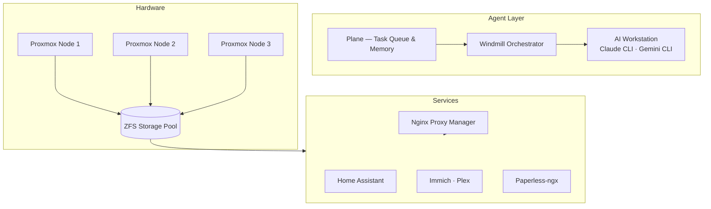

# Personal Homelab — AI Platform & Infrastructure

A personal home lab built around a core thesis: **AI agents should be assigned work the same way you'd assign it to a person — with defined tools, scoped credentials, and governance built in from the start.**

The infrastructure beneath it is a 3-node Proxmox cluster running a private cloud of self-hosted services. Everything runs on-premise, off the public internet.

---

## 🤖 The Agent Platform

The primary engineering project here is a multi-agent orchestration system. Two AI workers — **Claude** and **Gemini** — operate as assignable agents inside **Plane** (project management). A Python orchestrator running in **Windmill** polls for assigned tasks, locks them via a concurrency mechanism, routes execution to a dedicated AI workstation over SSH, and posts structured results back as Plane comments. Tasks move through states automatically: Backlog → In Progress → Review.

**Key governance controls:**
- **Permission scoping:** Agents run in Safe Mode by default. A `yolo` Plane label enables elevated permissions — controlled at the task level, not globally.
- **Credential isolation:** All credentials are managed via **1Password** and fetched at runtime. Nothing is stored in code or environment files.
- **Concurrency locking:** A `[PICKUP]` comment mechanism with Job ID verification ensures two agents cannot claim the same task simultaneously.
- **Persistent memory:** Each Plane issue carries a stable Conversation ID, giving agents full context continuity across multiple orchestrator runs.
- **Audit trail:** Every agent comment includes the agent name, Windmill Job ID, Conversation ID, timestamp, and orchestrator version.

→ See [`automation/`](./automation/) for source code and full documentation.

---

## 🏛️ Infrastructure

The cluster provides a high-availability foundation. Services run across Ubuntu VMs and LXC containers, with ZFS providing storage integrity, Proxmox Backup Server for daily VM snapshots, and encrypted off-site backups for critical data.

---

## 🛠️ Core Tech Stack

---

## 🗺️ Navigation

- **[Automation & AI Agents](./automation/)** — The orchestrator, agent architecture, and workflow engine.
- **[Infrastructure](./infrastructure/)** — Proxmox cluster, storage strategy, and backup design.
- **[Security & Networking](./security/)** — VPN, reverse proxy, DNS filtering, and credential management.
- **[Media & Photos](./media/)** — Private photo and media stack.
- **[Services Directory](./SERVICES.md)** — Full list of everything running in the Vault.

---
*This repository is a sanitized showcase. Internal hostnames, UUIDs, and credentials have been replaced with placeholders.*
