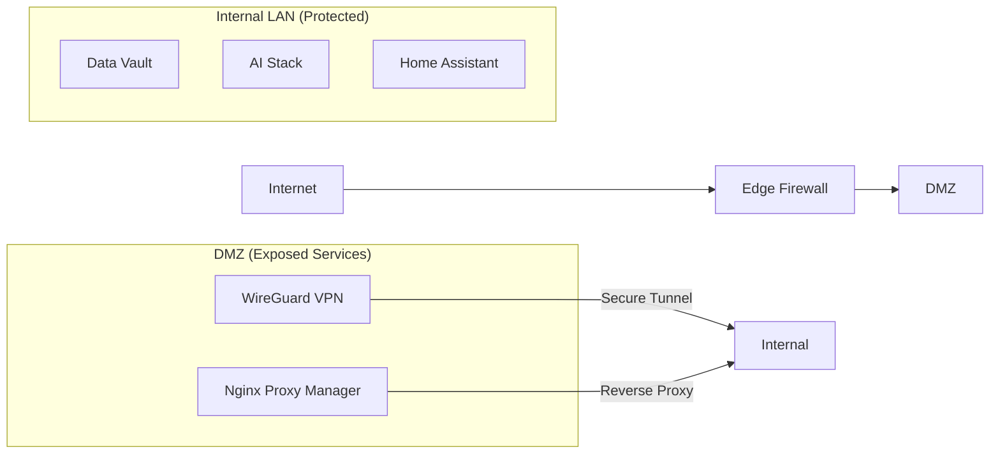

# Security & Networking: Private & Secure Access

The homelab uses a "defense in depth" strategy to secure its services, ensuring data is encrypted at rest and in transit, and that no internal service is ever directly exposed to the internet.

## 🛡️ Network Architecture

The network is partitioned into distinct zones to prevent lateral movement in the event of a breach.

## 🔑 Remote Access: WireGuard VPN

Remote access is strictly managed via **WireGuard**, a high-performance, modern VPN.
- **Zero Open Ports:** No internal services are directly exposed to the internet.
- **Point-to-Site:** Any authorized device can connect securely as if on the local network.
- **Encryption:** All traffic uses state-of-the-art cryptography with minimal attack surface.

## 🌐 Secure Traffic: Nginx Proxy Manager

For internal web services, **Nginx Proxy Manager** (NPM) handles SSL/TLS termination and reverse proxying.
- **Automatic SSL:** Let's Encrypt certificates are automatically managed and renewed.
- **Hostname Access:** Services are accessed via friendly internal and external hostnames.
- **Access Control:** IP-based restrictions and basic authentication are applied to sensitive dashboards.

## 🔐 Credential Management: 1Password

All service credentials — for both human and AI agent use — are managed via **1Password**.
- **No secrets in code:** AI agents and automation scripts retrieve credentials at runtime. Nothing is stored in scripts, environment files, or repositories.
- **Scoped agent access:** The AI Workstation has a restricted vault with access only to the credentials needed for its defined tool set (GitHub, Google Drive, and internal services).
- **Audit trail:** 1Password logs all vault access, providing a record of which credentials were used and when.

## 🚫 DNS-Level Protection: AdGuard Home

**AdGuard Home** acts as the primary DNS resolver for the entire network.
- **Ad & Tracker Blocking:** Thousands of tracking domains are blocked at the network level for every device.
- **Malware Protection:** Known malicious domains are sinkholed to prevent phishing and malware infections.
- **Private DNS:** DNS-over-HTTPS prevents ISP-level snooping of DNS queries.

## 🚨 Monitoring: PiAlert

**PiAlert** continuously scans the network for new or unexpected devices.
- **Intrusion Detection:** Immediate notification if an unknown device joins the network.
- **Device Management:** Historical record of every device's connection status and MAC address.

---
*Back to [Top](../README.md)*
